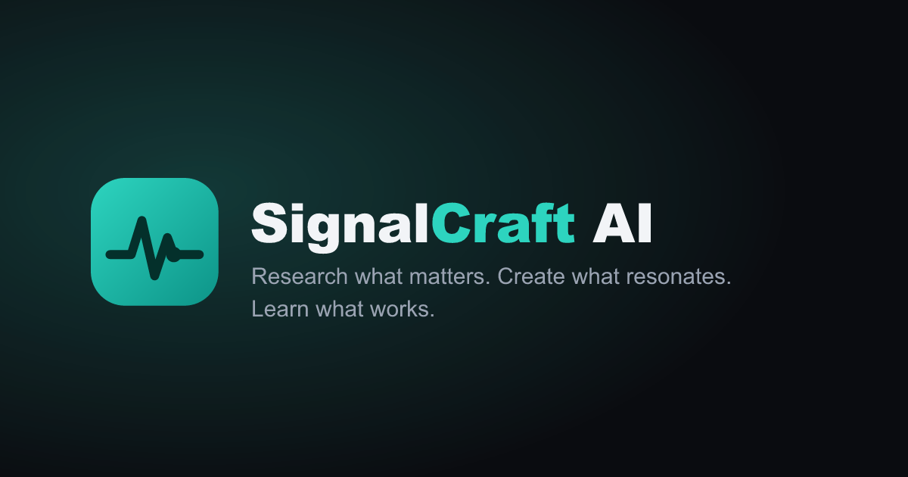

# SignalCraft AI

<p align="center">
  
</p>

<p align="center"><strong>Your personal AI content strategist</strong> — not another AI writing tool.</p>

<p align="center">
  
  
  
  
  
</p>

<p align="center">
  
</p>

SignalCraft learns who a creator is, watches what is happening in their niche
right now, and tells them *what to talk about, how to say it on each platform,
and what to do next* — based on what actually performed.

New users flow through **landing → signup → guided onboarding → personalized
dashboard**. Every preference persists through the API and drives research,
ranking, generation, and the agent:

```text
profile → research → trend intelligence → personalized opportunities
→ content agent → LinkedIn / X / Blog drafts → critique
→ performance analytics → memory → better recommendations
```

## Features

- **Guided onboarding** — identity, expertise, audience, goals, style,
  preferences and platforms in three steps; every field persists and the
  dashboard stays generic until setup completes.
- **Creator profile + preferences** — 14 profile fields plus content, platform
  and AI-behavior controls (tone, creativity, research depth, citations).
- **Creator Context service** — one personalization object built from profile,
  preferences, history, performance and memory, consumed by the agent, briefs
  and ranking.
- **Research engine** — live RSS plus clearly-labeled offline samples; GitHub,
  Reddit, YouTube, News, web search and search-trends plug in behind one
  interface. HTML, URLs and feed chrome are stripped before storage, so parser
  artifacts can never become trends. Sources and URLs are always preserved.
- **Trend intelligence** — transparent Trend Score (30% growth, 25% freshness,
  20% relevance, 15% source momentum, 10% novelty; weights configurable) with
  substring dedupe and per-creator relevance.
- **Content opportunities** — a separate Opportunity Score with trend,
  relevance, audience fit, freshness and competition, each explained as
  observed fact → interpretation → recommendation. Dismissals teach the ranker.
- **Content agent** — one orchestrator, nine named tools, bounded execution.
  Every draft is generated from a validated structured brief with supporting
  evidence and your best-performing voice, then critiqued (10 checks) and
  revised within strict retry limits. A sanitizer plus validation gate keeps
  internal reasoning and scaffolding out of user-facing text.
- **Explicit save flow** — generation returns an unsaved preview; only Save
  writes to the library (duplicates and leaks rejected). Versions, statuses
  (draft/ready/published/archived) and per-version bodies included.
- **Multi-platform output** — LinkedIn, X threads and Blog posts, each rendered
  from platform rules with word-bound and thread-structure checks.
- **Analytics & learning loop** — manual metric entry, engagement rate, Content
  Performance Score, best/worst topics, formats, hooks and content; insights
  feed creator memory and re-rank future recommendations.
- **Agent chat** — answers from real application data with collapsible
  execution traces and graceful degradation on tool failure.
- **Auth that is real** — email/password sessions plus Google OAuth
  (authorization-code flow, verified emails, CSRF-bound states); the Google
  button reports setup state instead of faking success when unconfigured.
- **LLM gateway** — Mock (offline) / OpenRouter / OpenAI-compatible providers,
  cheap-vs-strong task routing, per-call latency/token/cost tracking, offline
  test fixtures so the suite never spends quota.

## Tech stack

| Layer | Technology |
|---|---|
| Frontend | Next.js 14, TypeScript, CSS |
| Backend | Python, FastAPI, Pydantic |
| Domain core | Typed Python modules (`src/signalcraft`) |
| Database | SQLite (Postgres + pgvector path designed) |
| LLM | OpenRouter gateway with offline Mock fallback |
| Infra | Docker, docker-compose, Makefile |

## Quickstart

Prerequisites: Python 3.12+, Node 20+.

```bash
git clone https://github.com/Sanskar1724/signalcraft-ai.git
cd signalcraft-ai
python -m venv .venv
# Windows: .venv\Scripts\activate | macOS/Linux: source .venv/bin/activate
pip install -r requirements.txt
cp .env.example .env          # optional — offline defaults work with no keys
python scripts/seed.py --fresh  # demo creator, 21 drafts, performance history
```

Run the backend and frontend in two terminals:

```bash
# Terminal 1 — REST API on :8001
uvicorn apps.api.app.main:app --app-dir . --reload --port 8001

# Terminal 2 — dashboard on :3001
cd apps/web && npm install && npm run dev -- --port 3001
```

Open http://localhost:3001. Sign up, complete onboarding, and the dashboard
personalizes immediately. The API docs live at http://localhost:8001/docs.

## Configuration

All settings are environment-first; see `.env.example` for the full list.

| Variable | Purpose | Default |
|---|---|---|
| `SIGNALCRAFT_API_KEY` | API auth (`X-API-Key`); unset = open local mode | — |
| `OPENROUTER_API_KEY` | Live LLM provider; unset = offline Mock | — |
| `GOOGLE_CLIENT_ID` / `GOOGLE_CLIENT_SECRET` | Google OAuth; unset = setup state in UI | — |
| `CHEAP_MODEL` / `STRONG_MODEL` | Task-based model routing | `mock` / `openrouter/free` |
| `QUALITY_THRESHOLD` / `MAX_RETRIES` | Critic revise loop bounds | `7.5` / `1` |
| `TREND_WEIGHTS_JSON` / `OPP_WEIGHTS_JSON` | Scoring weight overrides | spec defaults |
| `NEXT_PUBLIC_API_URL` | Backend URL for the web app | `http://localhost:8001` |
| `CORS_ORIGINS` | Allowed browser origins | local dev ports |

## API reference

Full table in [`docs/api.md`](docs/api.md). Highlights:

```
GET    /api/health                        GET    /api/trends?sort=for_you|rising|latest
POST   /api/auth/signup|login|logout      GET    /api/auth/me
GET    /api/auth/google/status            GET    /api/auth/google/start|callback
GET    /api/onboarding/status             POST   /api/onboarding|/onboarding/complete
GET    /api/profile       PUT /api/profile  GET|PUT /api/preferences
GET    /api/opportunities                 PUT    /api/opportunities/{id}/dismiss
POST   /api/research                      POST   /api/content/generate (preview)
POST   /api/content/save                  POST   /api/content/critique
POST   /api/content/improve-preview       POST   /api/content/revise
GET    /api/content       GET /api/content/{id}  PUT /api/content/{id}/status
POST   /api/content/{id}/performance      GET    /api/analytics
GET    /api/insights                      POST   /api/agent/chat|/agent/learn
GET    /api/agent/memory                  GET|POST /api/calendar
GET    /api/context                       GET    /api/debug/llm
```

## Testing

```bash
pytest -q            # 40 tests: scoring, pipeline integrity, auth, onboarding,
                     # research normalization, leakage gates, REST + agent
cd apps/web && npm run typecheck && npm run build
```

LLM calls are mocked and live quota is forced off in fixtures — the suite needs
no network and no API keys.

## Project structure

```
apps/api/        FastAPI service (routers → services → agents/providers)
apps/api/migrations/  SQL migration history
apps/web/        Next.js dashboard (landing, auth, onboarding, 10 app pages)
packages/shared/ Shared API contracts
src/signalcraft/ Domain core (auth, profiles, research, trends,
                 opportunities, content, memory, analytics, agent, llm,
                 onboarding, personalization, jobs, security)
scripts/         seed.py — realistic, clearly-marked demo data
                 cleanup.py — dev-only purge of corrupted rows (refuses prod)
                 render-logo.py — brand PNG exporter
docs/            architecture, api, database, agent, frontend, development,
                 deployment, roadmap, implementation plan
```

## Deployment

See [`docs/deployment.md`](docs/deployment.md) for the pre-deploy checklist,
environment variables to collect, and platform recommendations (Vercel for the
frontend; Railway/Render/Fly.io for the API — serverless functions can't
persist SQLite).

## Roadmap

Publishing adapters, automatic scheduling, competitor analysis, A/B testing,
performance prediction, more LLM providers — details in
[`docs/roadmap.md`](docs/roadmap.md).
